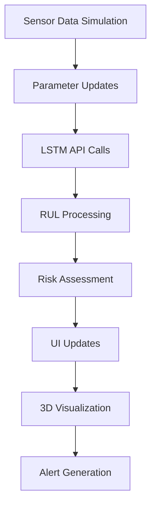

# 🛩️ SafeWing AI - Aviation Safety Dashboard

**Predictive Aircraft Maintenance Using LSTM Neural Networks**

  

> **Inspired by Air India Flight 171 Crash (June 2025)** - A tragic aviation disaster that claimed 280 lives, highlighting the critical need for predictive aircraft maintenance systems.

## 🎯 Mission Statement

SafeWing AI is an advanced aviation safety dashboard that uses Long Short-Term Memory (LSTM) neural networks to predict aircraft component failures **before** they become catastrophic. Our system monitors 6 critical aircraft subsystems in real-time and provides actionable insights to prevent aviation disasters.


## 🏗️ Architecture Overview

```
┌─────────────────┐    ┌──────────────────┐    ┌─────────────────┐
│   Next.js UI   │───▶│   API Proxy      │───▶│  Google Cloud   │
│   Dashboard     │    │   (CORS Handler) │    │   LSTM Models   │
└─────────────────┘    └──────────────────┘    └─────────────────┘
        │                        │                        │
        ▼                        ▼                        ▼
┌─────────────────┐    ┌──────────────────┐    ┌─────────────────┐
│   3D Aircraft   │    │   Real-time      │    │   Subsystem     │
│   Visualization │    │   Sensor Data    │    │   Predictions   │
└─────────────────┘    └──────────────────┘    └─────────────────┘
```

## 🔧 Technical Stack

### Frontend
- **Framework**: Next.js 13+ with App Router
- **Language**: TypeScript 5+
- **Styling**: Tailwind CSS + shadcn/ui
- **3D Graphics**: Three.js with React Three Fiber
- **State Management**: React Hooks + Context

### Backend
- **API Proxy**: Next.js API Routes
- **ML Models**: LSTM Neural Networks
- **Deployment**: Google Cloud Run
- **Database**: Real-time sensor simulation

### AI/ML Components
- **Engine System**: 24-feature LSTM model
- **Subsystem Models**: 5 individual LSTM models
- **Training Data**: Synthetic flight data based on C-MAPSS dataset
- **Prediction Frequency**: Every 3 seconds during simulation

## 🎛️ System Components Monitored

| System | Sensors | Critical Thresholds | LSTM Input |
|--------|---------|-------------------|------------|
| **Engine** | 24 sensors | RUL < 30 cycles | 24 features |
| **Hydraulic** | 3 sensors (Pressure, Flow, Temperature) | RUL < 25 cycles | 50 timesteps |
| **Electrical** | 2 sensors (Voltage, Current) | RUL < 25 cycles | 50 timesteps |
| **Control Surface** | 1 sensor (Deflection) | RUL < 25 cycles | 50 timesteps |
| **Cabin** | 1 sensor (Pressure) | RUL < 25 cycles | 50 timesteps |
| **Altimeter** | 1 sensor (Drift) | RUL < 25 cycles | 50 timesteps |

## 🎮 Key Features

### 1. **Real-Time 3D Aircraft Visualization**
- Interactive 3D aircraft model with part-specific highlighting
- Color-coded risk indicators (Green → Yellow → Red)
- Dynamic part selection based on subsystem health

### 2. **LSTM-Powered Predictions**
- **Engine RUL**: Remaining Useful Life in flight cycles
- **Subsystem Health**: Critical failure predictions
- **Risk Assessment**: Real-time safety scoring

### 3. **50-Second Takeoff Simulation**
- Realistic takeoff sequence (0-175 knots over 45 seconds)
- Dynamic sensor value updates every second
- LSTM predictions every 3 seconds
- Automatic simulation completion

### 4. **Advanced Dashboard Analytics**
- Multi-system health monitoring
- Predictive failure alerts
- Historical trend analysis
- Critical condition notifications

## 🚀 Quick Start

### Prerequisites
```bash
node >= 18.0.0
npm >= 8.0.0
```

### Installation
```bash
# Clone the repository
git clone https://github.com/hetpatel-11/BerkeleyHackathon.git
cd BerkeleyHackathon

# Install dependencies
npm install

# Run development server
npm run dev
```

### Available Scripts
```bash
npm run dev         # Start development server
npm run build       # Build for production
npm run start       # Start production server
npm run lint        # Run ESLint
```

## 🔬 LSTM Model Architecture

### Engine Model
```python
Input: [24 features] → LSTM(64) → Dense(32) → Output: [RUL_cycles]
Features: Temperature, Pressure, Flow, Vibration, etc.
Training: C-MAPSS inspired synthetic data
```

### Subsystem Models (5x)
```python
Input: [50 timesteps × sensors] → LSTM(32) → Dense(16) → Output: [RUL_prediction]
Hydraulic: [50 × 3] (Pressure, Flow, Temperature)
Electrical: [50 × 2] (Voltage, Current)
Control: [50 × 1] (Deflection)
Cabin: [50 × 1] (Pressure)
Altimeter: [50 × 1] (Drift)
```

## 📊 Risk Assessment Logic

### RUL Processing
```typescript
// Negative predictions = Critical failure imminent
if (rul < 0) {
  processedRUL = Math.max(1, Math.abs(rul) + degradationFactor)
  riskLevel = "danger"
}

// Risk thresholds
if (rul < 25) riskLevel = "danger"      // Critical
if (rul < 60) riskLevel = "warning"     // Caution
else riskLevel = "safe"                 // Normal
```

### Alert System
- 🔴 **Critical**: RUL < 25 cycles, immediate attention required
- 🟡 **Warning**: RUL 25-60 cycles, monitor closely
- 🟢 **Safe**: RUL > 60 cycles, normal operation

## 🌐 API Endpoints

### Local Development
```
POST /api/predict
Body: {
  "subsystem": "engine|hydraulic|electrical|control_surface|cabin|altimeter",
  "sequence": [array of sensor values]
}
```

### Production LSTM API
```
POST https://my-lstm-api-537563823214.us-central1.run.app/predict/{subsystem}
Body: {
  "sequence": [sensor_data_array]
}
```

## 📱 User Interface

### Main Dashboard
- **Engine System**: Primary RUL analysis with detailed metrics
- **Subsystem Grid**: 5 subsystem cards with real-time status
- **3D Aircraft**: Interactive model with part highlighting
- **Control Panel**: Simulation controls and settings

### Real-Time Simulation
1. **Pre-flight**: System initialization and checks
2. **Takeoff Roll**: 0-45 seconds, 0-175 knots acceleration
3. **Critical Phase**: V1 speed maintenance, maximum sensor stress
4. **Completion**: 50-second simulation cycle with full analysis

## 🔍 Data Flow



## 🛠️ Development Workflow

### File Structure
```
UC Hackathon/
├── app/                    # Next.js app directory
│   ├── api/predict/       # LSTM API proxy
│   ├── globals.css        # Global styles
│   ├── layout.tsx         # Root layout
│   └── page.tsx           # Home page
├── components/            # React components
│   ├── ui/               # shadcn/ui components
│   ├── aircraft-3d-viewer.tsx
│   ├── aircraft-visualization.tsx
│   ├── aviation-sidebar.tsx
│   └── prediction-panel.tsx
├── Dataset/              # Training data
├── public/               # Static assets
└── styles/               # CSS files
```

### Key Components
- **PredictionPanel**: Main dashboard logic and LSTM integration
- **Aircraft3DViewer**: Three.js 3D aircraft visualization
- **AviationSidebar**: System status and alerts
- **AircraftVisualization**: Component highlighting and risk display

## 🌟 Future Enhancements

### Phase 2 Features
- [ ] **Multi-Aircraft Fleet Management**
- [ ] **Historical Data Analytics**
- [ ] **Custom Alert Thresholds**
- [ ] **Maintenance Scheduling Integration**

### Phase 3 Features
- [ ] **Real Aircraft Sensor Integration**
- [ ] **Advanced ML Models (Transformers)**
- [ ] **Mobile Application**
- [ ] **Regulatory Compliance Module**

## 🤝 Contributing

### Development Setup
1. Fork the repository
2. Create feature branch: `git checkout -b feature/amazing-feature`
3. Commit changes: `git commit -m 'Add amazing feature'`
4. Push to branch: `git push origin feature/amazing-feature`
5. Open Pull Request


## 📄 License

This project is licensed under the MIT License - see the [LICENSE](LICENSE) file for details.

## 🙏 Acknowledgments

- **NASA C-MAPSS Dataset**: Foundation for synthetic training data
- **Next.js Team**: Excellent framework for modern web applications

**SafeWing AI Team**
- Repository: [BerkeleyHackathon](https://github.com/hetpatel-11/BerkeleyHackathon)
- Issues: [GitHub Issues](https://github.com/hetpatel-11/BerkeleyHackathon/issues)

---

**"Every flight matters. Every prediction saves lives."** ✈️💙

*Built with ❤️ for aviation safety at UC Berkeley Hackathon 2025*
